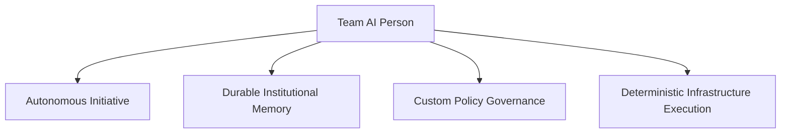
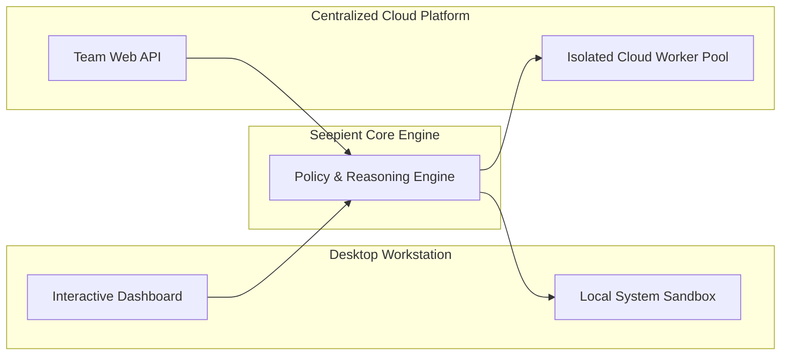

# Seepient: Engineering an AI Person, Not Just Another Chatbot

Most AI software deployed today is designed around a short-lived chatbot model. An employee types a prompt, the AI generates a single response, and the session ends. The next time someone opens the tool, the AI has forgotten the project context, business rules, and previous work.

When designing [Seepient](https://github.com/hashangit/seepient), I set out to build something fundamentally more valuable for growing businesses: an **AI Person**.

An AI Person isn't an ephemeral Q&A widget. It is a persistent digital colleague designed to plan multi-step initiatives, retain institutional memory across sessions, obey custom governance policies, and execute technical work safely.

This build log outlines the strategic architectural choices behind Seepient—why I prioritized headless execution over visual screen-clicking, and how my single engine scales from an individual workstation to a cloud platform for teams.

## What an AI Person delivers to a growing team

To move beyond basic text generation and deliver real operational ROI, an AI system must fulfill four core capabilities:

- **Autonomous Initiative.** Instead of requiring step-by-step human handholding, an AI Person accepts high-level business objectives—such as *"audit our server configuration and patch security vulnerabilities"*—and formulates the necessary steps, tool selections, and execution plans independently.
- **Durable Memory & Context.** Re-explaining processes to software burns valuable team hours. Seepient maintains persistent, tamper-evident memory stores that retain approved project permissions and historical decisions across system restarts.
- **Custom Policy Governance.** Unconstrained AI introduces operational risk. Seepient evaluates every intended action against business policy rules before any system change is executed.
- **Deterministic System Execution.** An AI Person must interact directly and reliably with business infrastructure, cloud environments, and data pipelines.

## Why headless automation beats visual screen-clicking

A common trend in AI demos is visual browser automation—having an AI "see" screens and click visual buttons. While visually appealing, screen-clicking software is fundamentally unsuitable for mission-critical business operations:

- **Visual layouts are fragile.** Minor UI updates, screen resolution changes, or web page redesigns cause visual AI tools to break unpredictably, creating constant maintenance overhead.
- **Real work runs in headless environments.** Production business systems, cloud servers, and data pipelines run in headless environments without graphical interfaces. A visual AI is blind in the very environments where production operations happen.
- **High latency and zero auditability.** Processing video streams and screenshots inflates computing costs and makes auditing action side-effects nearly impossible.

Seepient operates using a **headless, command-driven model**. Instead of clicking visual buttons, it communicates directly with operating systems through structured, secure protocols:
- System commands run inside isolated operating system sandboxes.
- Code and file updates stream through precise, line-anchored patch engines.
- Operational actions execute through standardized, typed capability interfaces.

This guarantees 99.9% execution determinism whether Seepient is running on a developer's workstation or inside a cloud server cluster.

## One engine, flexible deployment for teams

Growing businesses shouldn't have to maintain separate codebases for desktop utility tools and centralized cloud services. Seepient uses a single, unified core engine that adapts seamlessly across deployment models:

| Operational Mode | User Interface | Security & Execution Boundary | Business Use Case |
| --- | --- | --- | --- |
| **Workstation Mode** | Interactive Terminal Dashboard | Local OS-Level Process Sandbox | Individual developer productivity, local automation, private tasks |
| **Cloud Team Mode** | Secure Web API & WebSockets | Multi-Tenant Isolated Worker Containers | Centralized team workflows, automated background services, cloud infrastructure |

Because the core reasoning and security engine is completely decoupled from presentation layers, your business can deploy Seepient locally today and scale it into a cloud platform for your team tomorrow **without rewriting a single line of business logic**.

## Strategic takeaway

An AI Person isn't about creating a novel demo—it's about giving your team a secure, highly capable digital colleague that works alongside your staff and gets more effective over time.
