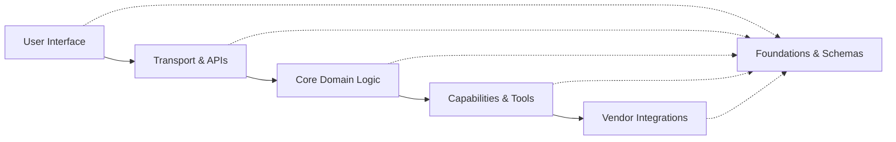
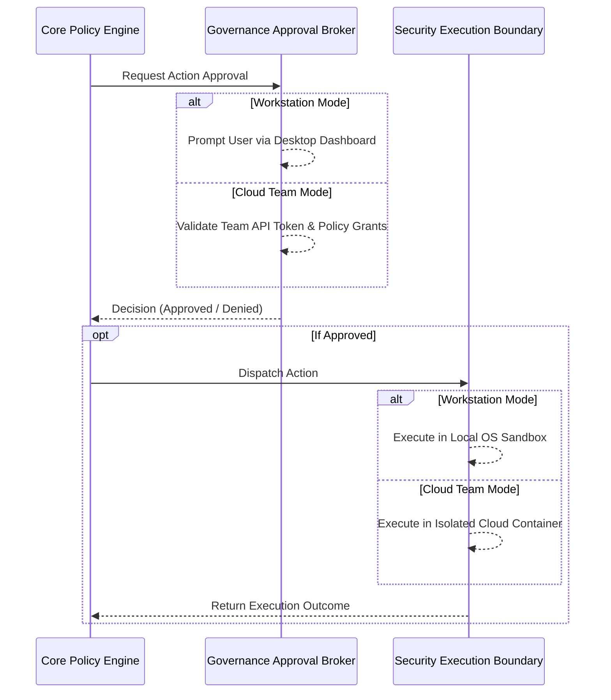

# Foundational Architecture: Designing for Evolution, Scale, and Zero Redundancy

Most AI software projects built under tight deadlines suffer from a common fate: within six months, they become bogged down by technical debt. Adding a new user interface, modifying an integration, or updating an underlying AI model breaks core security policies or causes unexpected system failures.

When engineering [Seepient](https://github.com/hashangit/seepient), I designed an architecture built specifically to absorb rapid technology evolution without fragility. The requirement was clear: support both local desktop usage and multi-tenant cloud services for teams on a single, clean codebase.

To achieve this, I implemented a strict **six-layer modular architecture**. This structure isn't abstract theory—it is an enforceable set of operational boundaries designed to eliminate duplicate logic, isolate system failures, and ensure zero vendor lock-in.

## The six-layer modular architecture

Every component within Seepient is strictly assigned to one of six structural layers:

```
User Interface → Transport → Core Domain → Capabilities → Vendor Integrations
                        ↘________________↗
                           Foundations
```

| Layer | Responsibility | Business Value |
| --- | --- | --- |
| **User Interface** | Interactive dashboards, status displays, and user feedback controls | Keeps visual presentation completely separated from underlying business rules |
| **Transport** | API gateways, protocol translation, and request authentication | Ensures secure communication regardless of interface (Web, API, CLI) |
| **Core Domain** | Agent reasoning loops, security policy evaluation, and session lifecycle | Protects core business logic and governance rules from external changes |
| **Capabilities** | Stable implementations for automation tools, file patchers, and sandboxes | Provides reliable, standardized system execution mechanisms |
| **Vendor Integrations** | Isolated wrappers for third-party AI provider models and APIs | Quarantines external dependencies so model changes never break system logic |
| **Foundations** | Universal data schemas, system error hierarchies, and security contracts | Provides shared data standards across the entire application ecosystem |

## The rule that protects the codebase

The single most critical architectural constraint in Seepient is the **one-way downward dependency rule**:

```
User Interface ──▶ Transport ──▶ Core Domain ──▶ Capabilities ──▶ Vendor Integrations
```

The `Foundations` layer sits underneath: any layer can access its standardized data definitions, but **it depends on no external application layer**.



### Why this rule matters for your business
- **Core business policy is protected.** The central reasoning engine has zero awareness of specific user interface components or API frameworks. Security policies apply identically whether an action originates from a mobile app, web dashboard, or automated script.
- **System failures are contained.** A display glitch or interface error can never corrupt active session state or bypass background security policy evaluation.
- **Zero vendor lock-in.** Third-party AI model providers are **strictly quarantined** inside the Vendor layer. If an AI provider updates its API, changes pricing, or if your business decides to switch to a private open-source model, only a single isolated wrapper file is updated.

> The underlying AI model isn't the architecture—it's a swappable component. Build your system so you can switch AI providers seamlessly without altering core business rules.

## Eliminating architectural rot

During early development, it was tempting to create generic "utility helper" directories for quick functions. In many software projects, these grab-bag directories become dumping grounds for unorganized code, creating hidden dependencies and security loopholes.

I eliminated generic utility grab-bags entirely. Every helper function and data structure in Seepient must belong to an explicit layer contract. 

Similarly, sibling capabilities—such as file automation and network communication tools—are forbidden from interacting directly. Instead, they communicate exclusively through standardized contracts managed at the application entrypoint. This strict isolation guarantees that a bug in one capability can never cascade into another.

## One engine, any deployment target

Because Seepient decouples policy logic from presentation and execution environments, your business can deploy the exact same core engine across diverse operational environments:



By injecting environment-specific approval brokers and execution boundaries at startup, the core policy engine operates flawlessly in both workstation and cloud environments for teams.
