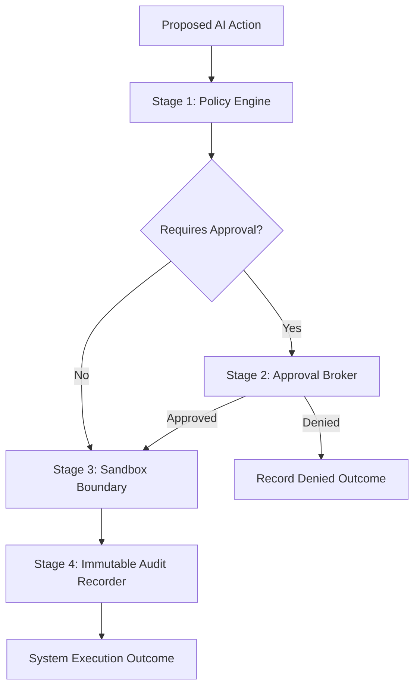
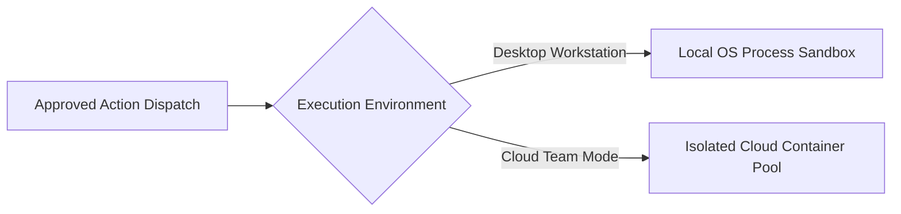

# Inside Seepient's Permission System: Policy, Approval, Execution, Audit

The single largest barrier to adopting autonomous AI systems in business operations is **trust**.

Business owners and team leads cannot grant AI tools access to production environments, business databases, or sensitive customer data if a single hallucinated command or prompt injection could compromise security, exfiltrate credentials, or cause data corruption.

Most consumer AI frameworks attempt to solve security with basic, ineffective mechanisms:
- **Binary approval overrides.** A single configuration flag that turns off all security filters.
- **Unscoped prompt warnings.** Asking human operators *"Do you want to run this action?"* for every minor read/write, causing approval fatigue.
- **Ephemeral permissions.** Forgetting approved permissions the moment a task completes, forcing repetitive manual confirmations.

For an **AI Person** designed to run autonomously across team networks, cloud containers, and servers, these simplistic approaches are unacceptable.

When engineering [Seepient](https://github.com/hashangit/seepient), I designed a formal **Four-Stage Security & Governance Pipeline**. Every action generated by an AI model is converted from an unconstrained request into a fully evaluated, sandboxed, and durably audited system transaction.

## The four-stage security pipeline

No action can execute within Seepient without traversing four mandatory governance stages sequentially:

| Stage | Security Component | Operational Responsibility |
| --- | --- | --- |
| **1** | **Policy Engine** | Evaluates proposed actions against business policies, file path boundaries, and active permission grants |
| **2** | **Approval Broker** | Manages human approval requests or validates pre-authorized capability tokens |
| **3** | **Sandbox Boundary** | Enforces operating system and container process isolation to prevent unauthorized system access |
| **4** | **Audit Recorder** | Writes tamper-evident, durable audit ledgers for compliance verification and operational review |

Crucially, **this governance pipeline is non-bypassable across all interfaces**. Desktop applications, cloud REST APIs, and automated background jobs all pass through the exact same four security stages.

## Stage 1: Security Policy Engine (Boundary enforcement)

Before any action touches a filesystem or network interface, Seepient's Security Policy Engine inspects the request to determine its intended side-effects: file modifications, process executions, network calls, or sensitive data reads.

The Policy Engine evaluates the action against active business governance rules:

- **Monotonic policy enforcement.** Permission boundaries can only *narrow* capability scope; sub-components can **never expand** authority beyond business policy ceilings.
- **Granular path-based boundaries.** File access uses strict path-matching rules. An approval for `./reports/**` authorizes access within the reports folder, but immediately blocks unauthorized access to system files or credential stores.
- **Independent multi-target validation.** When an AI proposes updating multiple files simultaneously, every target path is validated independently. If a proposal contains nine safe files and one unauthorized directory, the entire transaction is blocked before any modification occurs.

## Stage 2: Governance Approval Broker (Human oversight)

If the Policy Engine determines that an action requires human authorization, control shifts to the Governance Approval Broker:

- **Interactive Operator Mode.** Renders an explicit confirmation interface displaying the exact proposed change. Human managers can select *"Allow Once"*, *"Allow for Session"*, or *"Deny"*.
- **Headless Automated Mode.** Automated cloud services **never wait for an unavailable human operator**. If an action requires approval in headless mode and lacks a pre-authorized grant, it fails safely with an explicit policy error.
- **Durable Permission Memory.** When a manager approves a permission scope (such as *"Allow updates to ./dist/** for this session"*), the authorization is written to a secure, persistent store. Seepient remembers approved scopes across process restarts, eliminating redundant prompts.

## Stage 3: Sandbox Execution Boundary (Isolated containment)

Human approval is useless without physical process containment. If an approved script escapes its intended sandbox, authorization becomes meaningless.

### Process isolation & credential protection
Seepient leverages native operating system isolation and container sandboxing to enforce strict process containment:
- System commands execute within restricted sandbox profiles, constraining file modifications strictly to authorized directories.
- Cloud workers execute inside isolated container instances without access to host network interfaces.

### Credential separation
A fundamental security invariant in Seepient is **strict credential separation**:

> The control process holding your API keys is **never** the process executing AI-generated commands.

Even if an AI model executes an unauthorized command inside the sandbox, it cannot access or exfiltrate host environment variables or raw system credentials.

## Stage 4: Immutable Audit Recorder (Total transparency)

The final stage guarantees complete operational transparency. Every single decision—whether allowed, denied, or timed out—reaches exactly one terminal audit record.

The Audit Recorder writes tamper-evident audit streams to disk, preserving full execution context and idempotency keys. This enables complete session replay for compliance reviews and security audits.

## Default-on security invariants

In consumer AI tools, security is often treated as an optional setting. In Seepient, **the security pipeline cannot be disabled**:
- Automated execution flags skip interactive prompts, but path boundaries, OS sandboxing, and audit logging **always run**.
- Un-sandboxed execution requires loud, explicit administrative overrides accompanied by persistent audit alerts.
- API tokens can only **narrow** permission scope, never expand authority beyond administrative ceilings.
